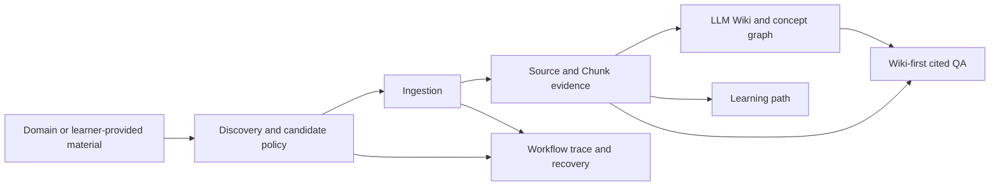

# Domain Atlas

**A traceable domain-learning system that turns selected sources into an LLM
Wiki, a structured learning path, and cited answers.**

Domain Atlas is not a generic chat UI. It keeps evidence and learning content
separate: source chunks preserve provenance; generated Wiki pages organize the
domain; answers cite the Wiki first and fall back to source evidence only when
needed.

<p align="center">
  
  
</p>

<p align="center">
  
  
</p>

## What It Does

- **Discover and ingest evidence**: search for candidate material, or import
  URLs, Markdown, and PDFs while retaining source provenance.
- **Build an LLM Wiki**: generate encyclopedia-style pages, concept links,
  source profiles, and a navigable workspace from the evidence layer.
- **Teach, not just retrieve**: create a staged learning path with explanations,
  knowledge blocks, examples, checks, practice tasks, and deeper reading.
- **Answer with citations**: use Wiki sections as the primary retrieval layer,
  with source-chunk fallback and explicit evidence-insufficient answers.
- **Fail visibly**: expose candidate selection, authority/region reasoning,
  ingestion progress, retries, and recovery states instead of silently building
  from weak material.

## Architecture



`Source -> Chunk` is the evidence layer. `Wiki page -> Wiki section` is the
learning layer. Stable citations connect both layers, so a learner can move
from a generated explanation back to its supporting source.

## Interaction Modes

| Mode | Intended workflow |
| --- | --- |
| Guided | Start with a domain; Domain Atlas searches, assesses candidates, ingests usable evidence, and builds the Wiki and learning path. Branded service workflows require direct or first-party evidence. |
| Expert | Search candidates, confirm sources, and run ingestion/build steps manually. Useful when the learner has a preferred source set or needs to override an automatic recommendation. |

Source access is treated as evidence quality, not as a hidden implementation
detail. A blocked URL, cross-region official page, insufficient direct evidence,
or inaccessible official service entry remains visible with provenance and a
recovery path.

## Quick Start

### Prerequisites

- Python 3.13
- [uv](https://docs.astral.sh/uv/)

```bash
git clone https://github.com/zhdchips/domain-atlas.git
cd domain-atlas
cp .env.example .env
uv sync --extra dev
uv run uvicorn domain_atlas.web.app:create_app --factory --reload
```

Open `http://127.0.0.1:8000`.

Configure real providers in `.env` only when using search, generation, or
embeddings. See [`.env.example`](.env.example) for the supported variables.

## Public Read-Only Demo

The deterministic portfolio Demo is safe to expose because it does not create
projects, accept uploads, read local data, or call Exa, LLM, embedding, or URL
providers.

```bash
PUBLIC_DEMO_MODE=true uv run uvicorn domain_atlas.web.app:create_app --factory
```

Open `http://127.0.0.1:8000/demo`. The prebuilt `Agent Harness Engineering`
case contains sources, a Wiki workspace, five learning modules, cited QA
examples, and a 25-check golden evaluation catalog.

## Docker

Build the image:

```bash
docker build -t domain-atlas:local .
```

Run the public Demo:

```bash
docker run --rm -p 8000:8000 \
  -e PUBLIC_DEMO_MODE=true \
  domain-atlas:local
```

For a local writable instance, mount `/app/data` and provide provider
configuration at runtime:

```bash
docker run --rm -p 8000:8000 \
  -v "$(pwd)/data:/app/data" \
  --env-file .env \
  domain-atlas:local
```

The writable mode is intended for a trusted local environment. It is **not** a
ready-made anonymous SaaS deployment: authentication, tenant isolation,
provider quotas, rate limits, SSRF protection, and upload governance require
additional production work.

## Verification

The default regression layers are deterministic and do not spend provider
credits:

```bash
uv run python scripts/regression.py --fast
uv run python scripts/regression.py --e2e
uv run python scripts/regression.py --golden-demo-eval
uv run python scripts/regression.py --browser-e2e
```

The browser check requires Chromium once:

```bash
uv run python -m playwright install chromium
```

Live provider verification is intentionally opt-in:

```bash
uv run python scripts/regression.py --live
uv run python scripts/regression.py --live-guided-e2e
```

The repository CI runs only the deterministic layers. It never receives Exa,
LLM, or embedding credentials.

## Project Boundaries

- Domain Atlas is a controlled, evidence-oriented workflow system. It does not
  claim fully autonomous general-purpose agent behavior.
- A source citation indicates the evidence available to the system; it is not a
  guarantee of factual completeness or legal ownership of a website.
- Search rankings and website access are external dependencies. Guided mode can
  pause for manual confirmation rather than fabricate a confident knowledge
  base.
- The public Demo is a fixed catalog integrity check, not a generic benchmark
  or a production accuracy claim.

## Development And Release

- [Contributing guide](CONTRIBUTING.md)
- [Changelog](CHANGELOG.md)
- [v0.1.0 release notes and remote publication checklist](docs/release-notes/v0.1.0.md)
- [Spec-driven iteration records](specs/iterations/)

## License

[MIT](LICENSE)
